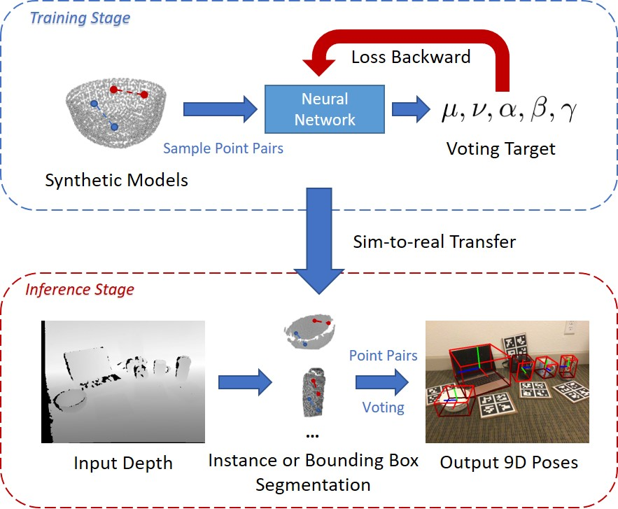

<h1 align="center">
CPPF: Towards Robust Category-Level 9D Pose Estimation in the Wild
</h1>

<p align='center'>
 </img>
</p>

<div align="center">
<h3>
<a href="https://qq456cvb.github.io">Yang You</a>, <a href="https://rshi.top/">Ruoxi Shi</a>, Weiming Wang, <a href="https://www.mvig.org/">Cewu Lu</a>
<br>
<br>
CVPR 2022
<br>
<br>
<a href='https://arxiv.org/pdf/2203.03089.pdf'>
  
</a>
<a href='https://qq456cvb.github.io/projects/cppf'>
  
</a>
<a href='https://youtu.be/MbR3Lq1kJaM'>

</a>
<br>
</h3>
</div>
 
  CPPF is a pure sim-to-real method that achieves 9D pose estimation in the wild. Our model is trained solely on ShapeNet synthetic models (without any real-world background pasting), and could be directly applied to real-world scenarios (i.e., NOCS REAL275, SUN RGB-D, etc.). CPPF achieves the goal by using only local $SE3$-invariant geometric features, and leverages a bottom-up voting scheme, which is quite different from previous end-to-end learning methods. Our model is robust to noise, and can obtain decent predictions even if only bounding box masks are provided.

# News
- **[2024.04]** Check our [CPPF++](https://github.com/qq456cvb/CPPF2) (TPAMI) for even **better results in the wild**!
- 
- **[2022.03]** Our another Detection-by-Voting method [Canonical Voting](https://github.com/qq456cvb/CanonicalVoting), which achieves SoTA on ScanNet, SceneNN, SUN RGB-D is accepted to CVPR 2022.

# Change Logs
- [2022.05.05] Fix a problem in scale target computing.

# Contents
- [Overview](#overview)
- [Installation](#installation)
- [Train on ShapeNet Objects](#train-on-shapenet-objects)
- [Pretrained Models](#pretrained-models)
- [Test on NOCS REAL275](#test-on-nocs-real275)
- [Test on SUN RGB-D](#test-on-sun-rgb-d)
- [Train on Your Own Object Collections](#train-on-your-own-object-collections)
- [Citation](#citation)
# Overview

This is the official code implementation of CPPF, including both training and testing. Inference on custom datasets is also supported.
  
# Installation
You can run the following command to setup an environment, tested on Ubuntu 18.04:
<details>
<summary><b>Create Conda Env</b></summary>

```
conda create -n cppf python=3.8
```
</details>

<details>
<summary><b>Install Pytorch</b></summary>

```
conda install pytorch torchvision cudatoolkit=10.2 -c pytorch-lts
```
</details>

<details>
<summary><b>Install Other Dependencies</b></summary>

```
pip install tqdm opencv-python scipy matplotlib open3d==0.12.0 hydra-core pyrender cupy-cuda102 PyOpenGL-accelerate OpenEXR
CXX=g++-7 CC=gcc-7 pip install MinkowskiEngine==0.5.4 -v
```
</details>

<details>
<summary><b>Miscellaneous</b></summary>

Notice that we use pyrender with OSMesa support, you may need to install OSMesa after running ```pip install pyrender```, more details can be found [here](https://pyrender.readthedocs.io/en/latest/install/index.html).

``MinkowskiEngine`` append its package path into ``sys.path`` (a.k.a., PYTHONPATH), which includes a module named ``utils``. In order not to get messed with our own ``utils`` package, you should import ``MinkowskiEngine`` after importing ``utils``.
</details>

# Train on ShapeNet Objects
<details>
<summary><b>Data Preparation</b></summary>

Download [ShapeNet v2](https://shapenet.org/) dataset and modify the ``shapenet_root`` key in ``config/config.yaml`` to point to the location of the dataset.

</details>

<details>
<summary><b>Train on NOCS REAL275 objects</b></summary>

To train on synthetic ShapeNet objects that appear in NOCS REAL275, run:
```
python train.py category=bottle,bowl,camera,can,laptop,mug -m
```

For laptops, an auxiliary segmentation is needed to ensure a unique pose. Please refer to <a href='#laptop-aux'>Auxiliary Segmentation for Laptops</a>/
</details>

<details>
<summary><b>Train on SUN RGB-D objects</b></summary>

To train on synthetic ShapeNet objects that appear in SUN RGB-D, run:
```
python train.py category=bathtub,bed,bookshelf,chair,sofa,table -m
```
</details>

<details>
<summary id='laptop-aux'><b>Auxiliary Segmentation for Laptops</b></summary>

For Laptops, geometry alone cannot determine the pose unambiguously, we rely on an auxiliary segmentation network that segments out the lid and the keyboard base.

To train the segmenter network, first download our Blender physically rendered laptop images from [Google Drive](https://drive.google.com/file/d/1gRHGt47nP9arDAu3hwnDNgfwJMxJYtCa/view?usp=sharing) and place it under ``data/laptop``. Then run the following command:
```
python train_laptop_aux.py
```
</details>


# Pretrained Models
Pretrained models for various ShapeNet categories can be downloaded from [Google Drive](https://drive.google.com/drive/folders/11wm5WHDjmSBfhng6emxCBBYZexmLoxLk?usp=sharing).
# Test on NOCS REAL275

<details>
<summary><b>Data Preparation</b></summary>

First download the detection priors from [Google Drive](https://drive.google.com/file/d/1cvGiXG_2ya8CMHss1IDobdL81qeODOrE/view?usp=sharing), which is used for evaluation with instance segmentation or bounding box masks. Put the directory under ``data/nocs_seg``.

Then download RGB-D images from [NOCS REAL275](http://download.cs.stanford.edu/orion/nocs/real_test.zip) dataset and put it under ``data/nocs``.

Place (pre-)trained models under ``checkpoints``.
</details>

<details>
<summary><b>Evaluate with Instance Segmentation Mask</b></summary>

First save inference outputs:
```
python nocs/inference.py --adaptive_voting
``` 

Then evaluate mAP: 
```
python nocs/eval.py | tee nocs/map.txt
```
</details>

<details>
<summary><b>Evaluate with Bounding Box Mask</b></summary>

First save inference outputs with bounding box mask enabled:
```
python nocs/inference.py --bbox_mask --adaptive_voting
``` 

Then evaluate mAP: 
```
python nocs/eval.py | tee nocs/map_bbox.txt
```
</details>

<details>
<summary><b>Zero-Shot Instance Segmentation and Pose Estimation</b></summary>

For this task, due to the memory limitation, we use the regression-based network. You can go through the process by running the jupyter notebook ``nocs/zero_shot.ipynb``.

</details>

# Test on SUN RGB-D
<details>
<summary><b>Data Preparation</b></summary>

We follow the same data preparation process as in [VoteNet](https://github.com/facebookresearch/votenet/blob/main/sunrgbd/README.md). You need to first download [SUNRGBD v2 data](http://rgbd.cs.princeton.edu/data/) (``SUNRGBD.zip``, ``SUNRGBDMeta2DBB_v2.mat``, ``SUNRGBDMeta3DBB_v2.mat``) and the toolkits (``SUNRGBDtoolbox.zip``). Move all the downloaded files under ``data/OFFICIAL_SUNRGBD``. Unzip the zip files.

Download the prepared extra data for SUN RGB-D from [Google Drive](https://drive.google.com/drive/folders/1FSn8j2wIq1VDm5FQNBKuKZ5Wx2G0Ox0S?usp=sharing), and move it under ``data/sunrgbd_extra``. Unzip the zip files.
</details>

<details>
<summary><b>Evaluate with Instance Segmentation Mask</b></summary>

First save inference outputs:
```
python sunrgbd/inference.py
``` 

Then evaluate mAP: 
```
python sunrgbd/eval.py | tee sunrgbd/map.txt
```
</details>

# Train on Your Own Object Collections

<details>
<summary><b>Configuration Explained</b></summary>

To train on custom objects, it is necessary to understand some parameters in configuration files.
- **up_sym**: Whether the objects look like a cylinder from up to bottom (e.g., bottles). This is to ensure the voting target is unambiguous.
- **right_sym**: Whether the objects look like a cylinder from left to right (e.g., rolls). This is to ensure the voting target is unambiguous.
- **regress_right**: Whether to predict the right axis. Some symmetric objects only have a up axis well defined (e.g., bowls, bottles), while some do not (e.g., laptops, mugs).
- **z_right**: Whether the objects are placed such that the right axis is [0, 0, 1] (default: [1, 0, 0]).
</details>
<details>
<summary><b>Voting Statistics Generation</b></summary>

Next, we need to know the ``scale_range`` (used for data augmentation, control possible object scales along the diagonal), ``vote_range`` (the range for center voting targets $\mu,\nu$), and ``scale_mean`` (the average 3D scale, used for scale voting). To generate them, you may refer to ``gen_stats.py``.
</details>

<details>
<summary><b>Write Configuration Files and Train</b></summary>

After you prepare the necessary configurations and voting statistics, you can write your own configuration file similar to that in ``config/category``, and then run ``train.py``.
</details>

# Citation
```
@inproceedings{you2022cppf,
  title={CPPF: Towards Robust Category-Level 9D Pose Estimation in the Wild},
  author={You, Yang and Shi, Ruoxi and Wang, Weiming and Lu, Cewu},
  booktitle={Proceedings of the IEEE/CVF Conference on Computer Vision and Pattern Recognition},
  year={2022}
}
```
